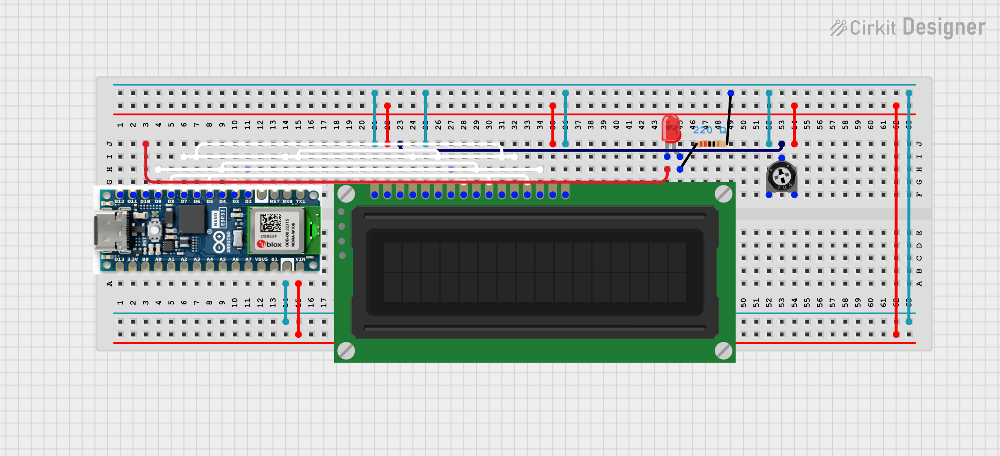

# Desk Mate

A small desk helper that displays information for you at your desk. It gets its information from a server it queries in regular intervals.

Hardware:
- Arduino Nano esp32 (though any devboard with an internet connection will do)
- 16x2 LCD screen
- Breadbordes, wires, various bits and bobs

Diagram

